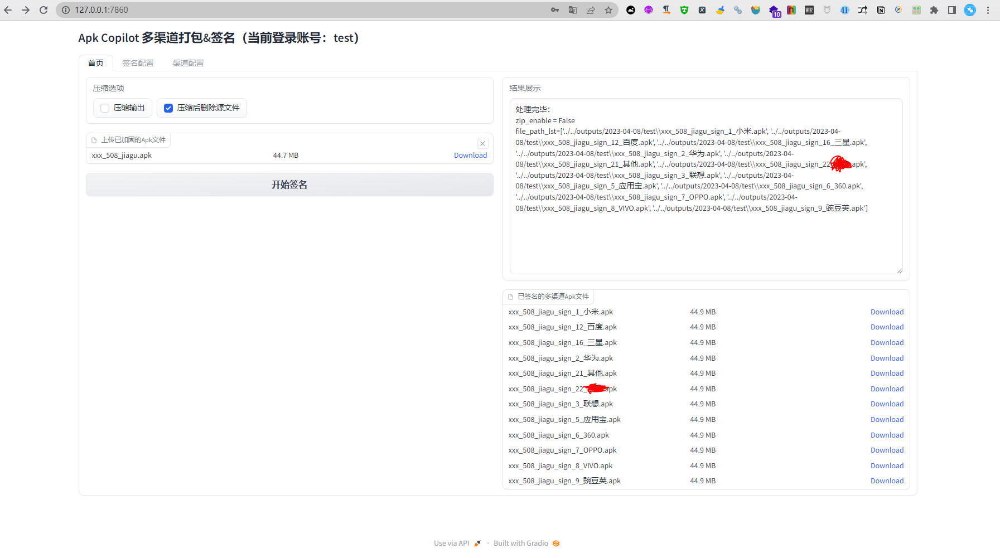
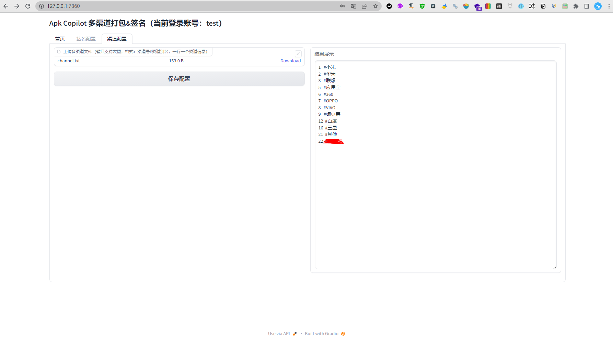

## ApkCopilot 多渠道打包&签名 
一个简易的ApkCopilot 多渠道打包&签名 + gradio操作界面。

### 版本信息（这里只是列出开发已知可行版本，其他版本需要使用这自己探索）
- java：`java version "17.0.2`，[下载地址>>](https://jdk.java.net/archive/)
- python：`Python 3.10`，[下载地址>>](https://www.python.org/downloads/)
- build-tools：`33.0.0`，[下载地址>>](https://androidsdkmanager.azurewebsites.net/Buildtools)

### docker方式运行
[点击这里查看docker说明](docker/README.md)


### 本地源码运行

- 安装依赖
先按`版本信息`配置本地环境，然后创建python的env环境，安装python依赖：
```shell
pip install -r requirements.txt
```

- 复制配置
```shell
cp config.dev.json config.json
```
```shell
cp -R 本地路径xxx/build-tools/31.0.0 res/build-tools/31.0.0
```

- 运行
> gradio界面
```shell
uvicorn app:app --reload --host 0.0.0.0 --port 7860
```

### 相关截图


